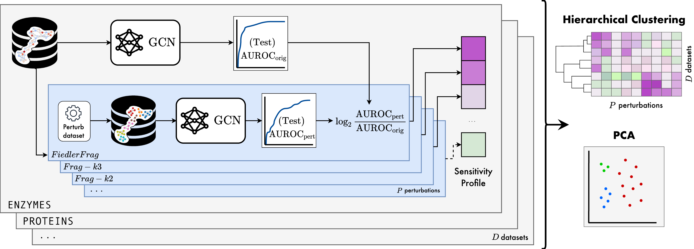

# GTaxoGym: Taxonomy of Benchmarks in Graph Representation Learning

[](https://arxiv.org/abs/2206.07729)


Graph Neural Networks (GNNs) extend the success of neural networks to graph-structured data by accounting for their intrinsic geometry. While extensive research has been done on developing GNN models with superior performance according to a collection of graph representation learning benchmarks, it is currently not well understood what aspects of a given model are probed by them. For example, to what extent do they test the ability of a model to leverage graph structure vs. node features?
Here, we develop a principled approach to taxonomize benchmarking datasets according to a *sensitivity profile* that is based on how much GNN performance changes due to a collection of graph perturbations.
Our data-driven analysis provides a deeper understanding of which benchmarking data characteristics are leveraged by GNNs. 
Consequently, our taxonomy can aid in selection and development of adequate graph benchmarks, and better informed evaluation of future GNN methods. Finally, our approach is designed to be extendable to multiple graph prediction task types and future datasets.


### Installation
We use [GraphGym from PyG2](https://pytorch-geometric.readthedocs.io/en/2.0.4/notes/graphgym.html) to manage our experimental setup. PyG v2.0.4 is required.

First, setup Python environment with PyG dependencies:

```bash
conda create -n gtaxogym python=3.9
conda activate gtaxogym

conda install pytorch=1.11 torchvision torchaudio cudatoolkit=11.3 -c pytorch -c nvidia
conda install pyg=2.0.4 -c pyg -c conda-forge

conda clean --all
```

Install rest of the dependencies via pip

```bash
pip install -r requirements.txt
```

Then install GTaxoGym in editable mode (no need to reinstall every time the source code is modified)

```bash
pip install -e .
```

### Examples
```bash
# Default graphgym example.
python main.py --cfg configs/example.yaml --repeat 3
# A run with perturbation, logging to W&B, and run 'name-tagging'.
python main.py --cfg tests/configs/graph/nci1.yaml perturbation.type Fragmented-k2 train.mode custom wandb.use True name_tag test01
```

### Unit tests

To run all unit tests, execute from the project root directory:

```bash
python -m unittest -v

# Alternatively using the pytest framework.
pytest unittests -v
```

Or specify a particular test module, e.g.:

```bash
python -m unittest -v unittests.test_fast_auroc_multi
```


## Citation

If you find this work useful, please cite our paper:
```bibtex
@article{liu2022GTaxonomy,
  title={Taxonomy of Benchmarks in Graph Representation Learning}, 
  author={Liu, Renming and Cantürk, Semih and Wenkel, Frederik and Sandfelder, Dylan and Kreuzer, Devin and Little, Anna and McGuire, Sarah and O'Bray, Leslie and Perlmutter, Michael and Rieck, Bastian and Hirn, Matthew and Wolf, Guy and Rampášek, Ladislav},
  journal={arXiv:2206.07729},
  year={2022}
}

```
